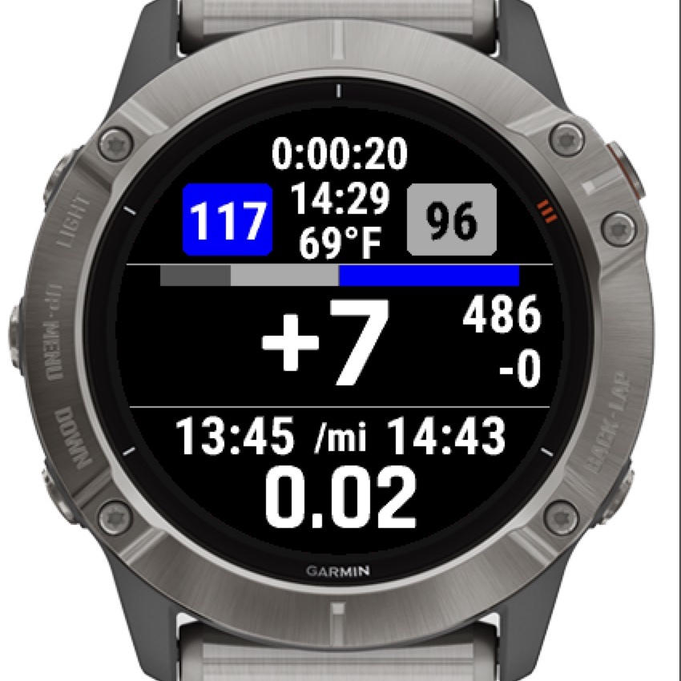

# vertlover

Vertlover is a Garmin Connect IQ data field for those who are
addicted to elevation gain on their trail runs, hikes, skimo, and other
mountain adventures.

The number displayed in the largest font is dedicated to total ascent.  To the
right of it are the current elevation (top) and the total descent (bottom).  

The current heart rate (left) and average heart rate (right) appear in boxes at
the top, colored by the corresponding heart rate zone (configured in the user's
Garmin Connect profile).  A horizontal bar appears below the heart rate
indicators showing the amount of time spent in each heart rate zone.

The top third of the screen shows the elapsed time, current time, and
temperature.  The bottom third shows current pace (left) and average pace
(right), and the total distance covered is at the very bottom.  The data screen
can be configured to show speed instead of pace by editing its settings in the
Garmin Connect App.

## Installation

1. Use the Garmin Connect App (mobile) or Garmin Express (PC/Mac) to install
   [the data screen from the Connect IQ
   store](https://apps.garmin.com/en-US/apps/56e751fa-5fc0-4482-bce8-e32c63567047)
   to the watch.
2. Start the activity type where you would like to see the data screen.  Press
   and hold the menu button, and select the activity type's settings > data
   screens.
3. Add a new single-field screen or edit an existing one and then edit
   Field 1 > Connect-IQ > vertlover.

## Release history:

### 1.5.0 (latest)
- Added support for Enduro 3 and Fenix 8 watches

### 1.4.2
- Removed battery and GPS accuracy bars
- Fixed reset issues with HR zone distribution bar
- Added support for Resume Later
- Added support for descent*, fr955, fenix7*, enduro2, epix2, marq2 watches
- Other layout enhancements

### 1.3.0:
- Added heart rate zone distribution bar
- Added support for Garmin Enduro

### 1.2.2:

- Made heart rate zones follow profile for currently selected sport

### 1.2.1:

- Updated foreground color black for light gray HR zone

### 1.2.0:

- Current and average heart rates are colored by heart rate zone and easier to
  monitor.
- Temperature replaces cadence.
- Total ascent field is bigger than ever!
- Support for new watch types:
  - Forerunner 745 / 945
  - Fenix 6 / 6s / 6 Pro
  - Fenix 6X Pro / Chronos
  - Marq Adventurer / Athlete / Aviator / Captain / Commander / Driver /
    Expedition / Golfer
  - Venu / Venud
  - Vivoactive 4 / 4s

### 1.1.1

* Cadence vs. temp selectable in settings.
* Speed vs pace selectable in settings.
* Support for Fenix 5s Plus / 5 Plus / 5X Plus.

### 1.0.0

- A screen is born!
